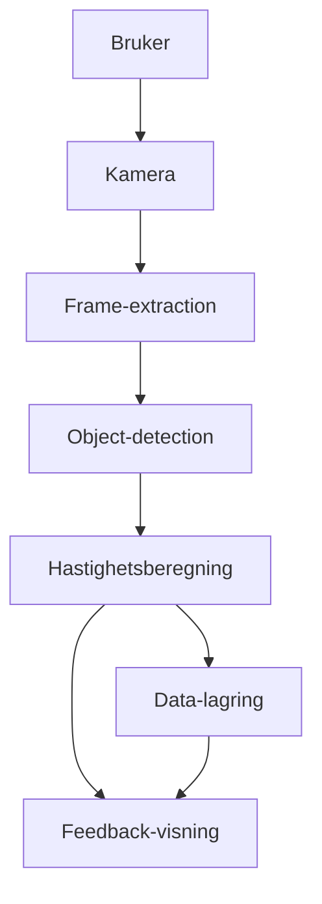

Flowchart av appflyten

```mermaid
flowchart TD
    Bruker
    Kamera
    Frame-extraction
    Object-detection
    Hastighetsberegning
    Feedback-visning
    Data-lagring 

    Bruker 
    --> Kamera 
    --> Frame-extraction
    --> Object-detection
    --> Hastighetsberegning
    --> Feedback-visning 

    Hastighetsberegning --> Data-lagring --> Feedback-visning


```
Kamera - AVFoundation 

Object-detection - Vision / CoreML